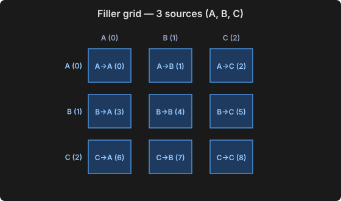

# ComfyUI VideoFillerGrid

A single node, **VideoFillerGrid Assemble**, that joins source clips and 
(generated) transition clips that bridge them into one video, following an order
list, and writes it straight to disk.


## How the pieces fit together

You provide `N` source clips and the `N×N` fillers that transition between every
ordered pair of them. A filler is addressed by its `(source, target)` pair; the
fillers arrive in cartesian order, so filler `k` is the `s → t` transition where
`k = s×N + t`.



The node does not generate the fillers or decide the pairs — that is yours. A
bundled subgraph, **Gen Segments Order List (Looping)**, can emit a random order
list from this grid (it does not exclude self-transitions).

The `order` file then walks the grid, one `clipIndex,fillerIndex` per line:

```
0,1        emit clip A, then filler A→B
1,3        emit clip B, then filler B→A
0,0        emit clip A, then filler A→A
```

Each unit contributes its source clip followed by its filler, so the cut reads
`A → A→B → B → B→A → A → A→A → A` — a chain stitched from the grid's cells.


### Bad input

The node accepts any pairing: `clipIndex` and `fillerIndex` are independent, and
out-of-range indices are the only hard error. Pairing a clip with a filler whose
source is a different clip (e.g. `1,2` — clip B with filler A→C) is valid input
and will encode, but the cut will not make sense.


## Install

Drop the folder into `ComfyUI/custom_nodes/` and restart ComfyUI:

No extra dependencies. It uses `av` (PyAV) and `torch`, which ComfyUI already
ships, and `torchaudio` only when a filler's audio needs resampling.


## Geometry, rate and audio

- **Frame size** comes from the first clip. Fillers are rescaled to match with
  `common_upscale` (lanczos, centre) if they differ — handy while testing at a
  lower generation resolution.
- **Frame rate** comes from the first filler, i.e. the generator's native rate.
- **Audio** is normalised to 48 kHz stereo. A source with no audio track
  contributes exact silence, so clips and fillers can be mixed freely.
- Segment audio is trimmed or zero-padded to exactly match its frames.


## Looping cuts

Set `seconds = 0` to disable truncation and write every unit whole.

This matters when the order is built so the closing filler leads back to the
first clip (`t(i) = s((i+1) mod k)`). Trimming to a duration would clip that
final filler part-way and the join back to the start would no longer land, so
the loop would visibly break. With `seconds = 0` the cut ends exactly where the
closing filler ends, and playback on repeat is as seamless as any join inside
it.


## Failure modes worth knowing

- **Wrong `N`.** If `len(fillers) != len(clips) ** 2` the indices in the order
  file will not mean what you think. The node does not enforce it — a partial
  grid is legal — but it is almost always a sign of stale files.
- **`seconds` longer than the material.** The walk ends when the order runs out;
  you get everything, not a padded file.